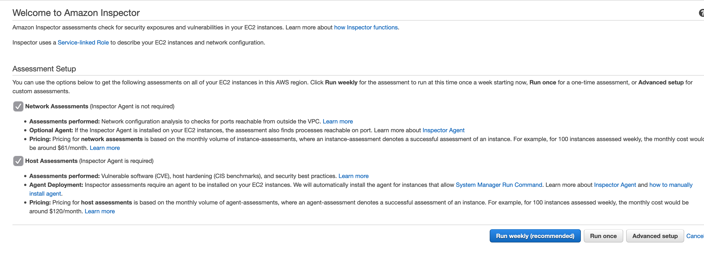
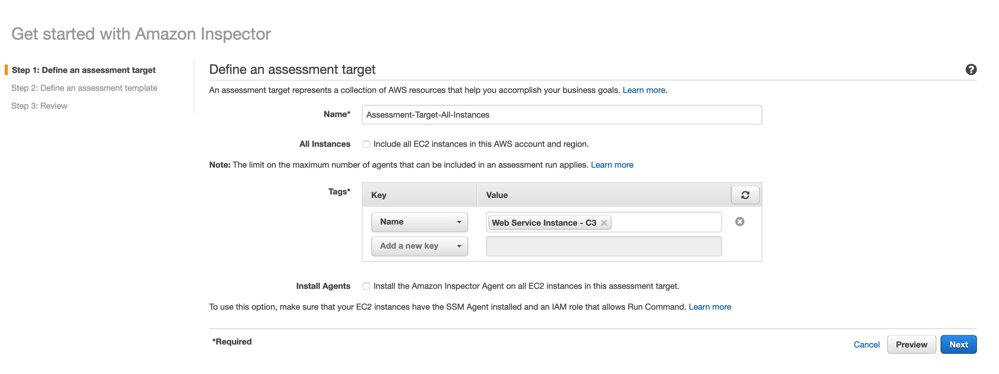

# Project 03 - AWS Cloud Architect - Udacity Nanodegree

## Exercise 2: Enable Security Monitoring
 
**_Deliverables for Exercise 2:_**
- **E2T2_config.png** - Screenshot of AWS Config showing non-compliant rules.
- **E2T2_inspector.png** - Screenshot of AWS Inspector showing scan results.
- **E2T2.png_securityhub.png** - Screenshot of AWS Security Hub showing compliance standards for CIS foundations.
- **E2T2.txt** - Provide recommendations on how to remediate the vulnerabilities.
 
### Task 1: Enable Security Monitoring using AWS Native Tools
 
First, we will set up security monitoring to ensure that the AWS account and environment configuration is in compliance with the CIS standards for cloud security.
 
#### 1. Enable AWS Config (skip this step if you already have it enabled)  
 a. See below screenshot for the initial settings.   
   
 b. On the Rules page, click **Skip**.  
 c. On the Review page, click **Confirm**.
#### 2. Enable AWS Security Hub
 a. From the Security Hub landing page, click **Go To Security Hub**.  
b. On the next page, click **Enable Security Hub**
#### 3. Enable AWS Inspector scan
 a. From the Inspector service landing page, leave the defaults and click **Advanced**.  
   
 b. Uncheck **All Instances** and **Install Agents**.  
 c. Choose Name for Key and ‘Web Services Instance - C3’ for value, click **Next**.  
   
 d. Edit the rules packages as seen in the screenshot below.  
   
 e. Uncheck **Assessment Schedule**.  
 f. Set a duration of 15 minutes.
 g. Click **Next** and **Create**.
#### 4. Enable AWS GuardDuty
a. After 1-2 hours (or 1 night), data will populate in these tools giving you a glimpse of security vulnerabilities in your environment.

Tip: https://knowledge.udacity.com/questions/281101
GuardDuty consume data from AWS CloudTrail, VPC Flow Logs, and DNS logs to generate security findings, make sure you have those services enable.
I also recomen to activate Guardduty for all the regions, If GuardDuty is not enabled in all supported Regions, its ability to detect activity that involves global services is reduced.

### Task 2: Identify and Triage Vulnerabilities
 
Please submit screenshots of:
- AWS Config - showing non-compliant rules
- AWS Inspector - showing scan results
- AWS Security Hub - showing compliance standards for CIS foundations.
 
Name the files E2T2_config.png, E2T2_inspector.png, E2T2_securityhub.png respectively.
 
Research and analyze which of the vulnerabilities appear to be related to the code that was deployed for the environment in this project. Provide recommendations on how to remediate the vulnerabilities. Submit your findings in E2T2.txt
 
**Deliverables:** 
- **E2T2_config.png** - Screenshot of AWS Config showing non-compliant rules.
- **E2T2_inspector.png** - Screenshot of AWS Inspector showing scan results.
- **E2T2.png_securityhub.png** - Screenshot of AWS Security Hub showing compliance standards for CIS foundations.
- **E2T2.txt** - Provide recommendations on how to remediate the vulnerabilities.
 